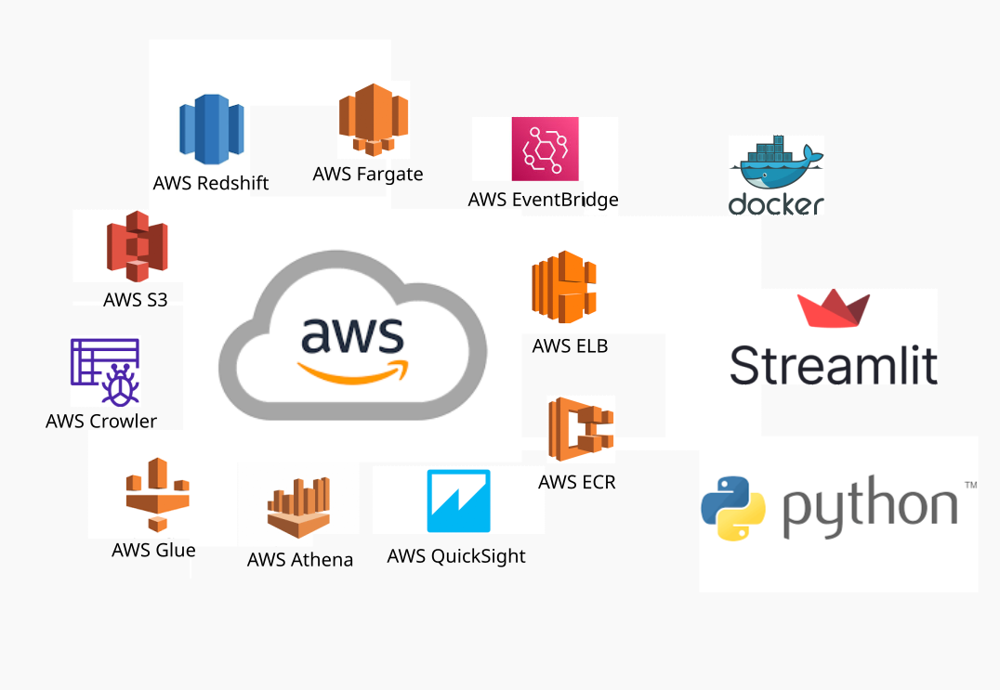

# Análisis Integrado para la Toma de Decisiones Estratégicas
---
## Contexto:
En un entorno donde los servicios de taxis y viajes compartidos han revolucionado la movilidad urbana en Nueva York, generando una vasta cantidad de datos, surge la necesidad de comprender y aprovechar esta información para mejorar la eficiencia y la sostenibilidad del transporte de pasajeros. Paralelamente, la urgencia de abordar el cambio climático impulsa a las empresas a explorar alternativas más limpias y sostenibles, como la incorporación de vehículos eléctricos a sus flotas, con el fin de reducir la contaminación y mitigar el impacto ambiental.

## Misión:
Nuestro equipo ha sido contratado por una empresa de servicios de transporte de pasajeros, con la finalidad de acompañarla en el proceso de toma de decisiones relacionado con la posible implementación de vehículos eléctricos en su flota. Para ello, utilizaremos datos de alta calidad proporcionados por la empresa, así como otros obtenidos de fuentes externas, como los servicios de taxis y viajes compartidos, la calidad del aire, la contaminación sonora y las correlaciones climáticas. Este análisis exhaustivo nos permitirá evaluar la viabilidad y los impactos potenciales de esta iniciativa.

## Visualizaciones
---
Para evaluar el proceso de toma de decisión, desde el año 2022 en adelante.

- [Visualización de datos](https://us-east-1.quicksight.aws.amazon.com/sn/accounts/381492307502/dashboards/b18224c0-471c-4d94-800e-4aee5eac30dd?directory_alias=henry2-2024)

Para una consulta de los datos en tiempo real, se realizó un sistema de recomendación.

- [Análisis de datos]()

- [Modelo de Machine Learning]()

## Desarrollo del proyecto 
--- 
El proyecto se llevo a cavo en tres etapas 
- 1° Etapa del proyecto [Sprint_1](https://github.com/eremohn/huella_de_carbono_en_NYC/tree/main/Sprint_1)
- 2° Etapa del proyecto [Sprint_2](https://github.com/eremohn/huella_de_carbono_en_NYC/tree/main/Sprint_2)
- 3° Etapa del proyecto [Sprint_3](https://github.com/eremohn/huella_de_carbono_en_NYC/tree/main/Sprint_3)  

## Datasets
---
- [Fuente data de viajes](https://www1.nyc.gov/site/tlc/about/tlc-trip-record-data.page)
- [Datos de Transporte Publico](https://developers.google.com/transit?hl=es-419)
- [Historical Weather API](https://open-meteo.com/en/docs/historical-weather-api)
- [API's de las condiciones climáticas](https://api.openweathermap.org/)
- [Dataset de Kaggle sobre emisiones de co2 por pais y año, con ajustes por población](https://www.kaggle.com/datasets/lobosi/c02-emission-by-countrys-grouth-and-population)
- [Dataset de los sonidos recolectados en NYC](https://zenodo.org/record/3966543)
- [Dataset de la calidad del aire de NYC](https://data.cityofnewyork.us/Environment/Air-Quality/c3uy-2p5r)
- [Que es un Borough?](https://en.wikipedia.org/wiki/Boroughs_of_New_York_City)
- [Fuel consumption raitings](https://open.canada.ca/data/en/dataset/98f1a129-f628-4ce4-b24d-6f16bf24dd64#wb-auto-6)
- [State carbon dioxide emissions from fossil fuels tables: New York](https://www.eia.gov/environment/emissions/state/excel/states/new%20york.xlsx)

## Tecnologías empleadas
---

## Presentación
[Demo](https://view.genially.com/6642693ba5b3240014a4742d/presentation-hacia-una-movilidad-sostenible)

## Insights
---
[Informe](https://github.com/eremohn/huella_de_carbono_en_NYC/tree/main/Informe)  

## Integrantes 
---

Cloud Architect
- Javier Hernandez: 7.matute@gmail.com | www.linkedin.com/in/javier-hernandez-a098b726b | remolino777.

Data Engineer / Data Science 
 - Javier Hernandez: 7.matute@gmail.com | www.linkedin.com/in/javier-hernandez-a098b726b | remolino777. 
 - nombre:correo | Linkedin | GitHub.
 - nombre:correo | Linkedin | GitHub.

 Data Analyst / Data Science
 - Felipe Varela: varela.miranda.f@gmail.com | [GitHub.](https://github.com/eremohn)
 - nombre:correo | Linkedin | GitHub.

 Academia Henry:
 - Henry Mentor:  Lautaro Paniagua | Linkedin | GitHub.
 - Product Owner: | Linkedin | GitHub.
 
