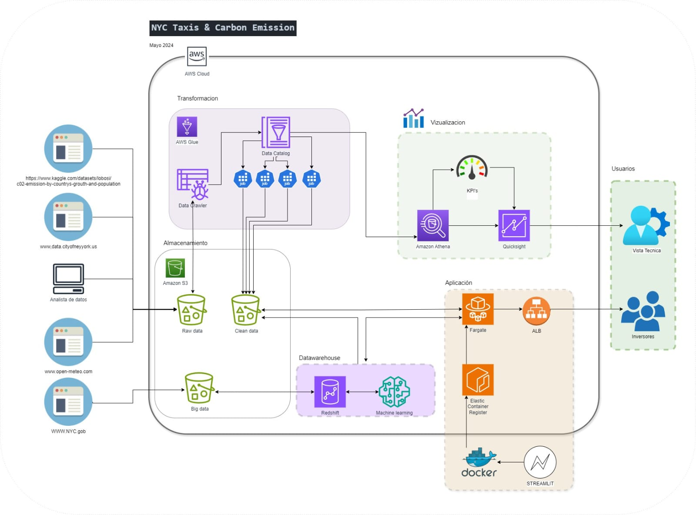

## Puesta en marcha del proyecto
### Contexto
---
Una empresa de transporte de pasajeros, actualmente enfocada en el sector de micros de media y larga distancia, busca expandir sus operaciones al ámbito del transporte de pasajeros en automóviles. Con el objetivo de alinearse con las tendencias del mercado y promover un futuro más sostenible, la empresa está interesada en investigar la relación entre los vehículos particulares, la calidad del aire y la contaminación sonora. Este estudio tiene como fin evaluar la viabilidad de incorporar vehículos eléctricos a su flota, ya sea parcial o totalmente.

Sin embargo, al tratarse de una nueva unidad de negocio, la empresa necesita realizar un análisis preliminar del movimiento de taxis en la ciudad de Nueva York para obtener un marco de referencia sólido que respalde sus decisiones.

Nuestro equipo ha sido contratado para acompañar a la empresa en este proceso de toma de decisiones. Utilizaremos datos de alta calidad, incluyendo información sobre viajes compartidos, calidad del aire, contaminación sonora y correlaciones climáticas, para proporcionar análisis y recomendaciones fundamentadas que apoyen el crecimiento y la sostenibilidad del negocio.

### Propuesta de Trabajo
---
Como equipo, tomamos la decisión de utilizar el servicio de AWS con la finalidad de poder almacenar todos los datasets en crudo. Una vez en la nube, los datos serán procesados realizando el ETL para obtener una base de datos limpia y poder trabajar sobre ellas en un EDA.
El proceso de visualización se dividirá en dos etapas:
1. La primera etapa estará dirigida a los usuarios/clientes expertos, aquellos encargados de la parte de gestión e inversiones. Las visualizaciones más específicas serán destinadas a este grupo de usuarios.
2. La segunda etapa estará dirigida a los usuarios/clientes no expertos, aquellos que representan a los dueños de la inversión y del negocio en sí. La finalidad de esta visualización es poder entregarles una generalidad del proyecto para poder responder todas sus dudas desde una perspectiva macro de la inversión y toma de decisiones.

  

### Indicadores Clave de Desempeño
---
**KPI 1: Incremento de Viajes en Taxis**
- El número de viajes en taxis realizados aumenta en un 10% respecto al trimestre anterior, reflejando un crecimiento en la demanda de transporte urbano.

**KPI 2: Variación de CO2 en Estados Unidos**
- Se observa un incremento del 5% en los niveles de dióxido de carbono (CO2) en Estados Unidos con respecto al año anterior, lo que sugiere un posible impacto en la calidad del aire y destaca la necesidad de soluciones más sostenibles.

**KPI 3: Adopción de Taxis Verdes**
- La proporción de taxis eléctricos o 'verdes' en la flota de vehículos de transporte urbano cumple con el 15% de incremento establecido en un periodo de 1 año, demostrando una transición hacia opciones más ecológicas y sostenibles en el transporte de pasajeros.

### Tecnologías empleadas
---
**Usuario experto en análisis de datos:**

- Buckets: Utiliza buckets de almacenamiento de objetos en AWS S3 para almacenar conjuntos de datos y archivos necesarios para el análisis.
- AWS Glue ETL: Emplea AWS Glue para realizar tareas de extracción, transformación y carga (ETL) de datos, lo que le permite preparar los datos para su análisis.
- AWS Athena: Realiza consultas a través de AWS Athena para acceder y analizar los datos almacenados en el catálogo de AWS Glue, lo que le brinda capacidades de consulta SQL en datos estructurados y no estructurados.
- AWS QuickSight: Utiliza AWS QuickSight como una herramienta de visualización de datos para crear y compartir paneles interactivos y visualizaciones que ayudan en el análisis y la toma de decisiones.

**Usuario no experto (inversionista):**

- Docker: Crea contenedores para almacenar la información y las aplicaciones necesarias para el análisis de datos. Docker proporciona un entorno consistente y portátil para ejecutar aplicaciones.
- ECR (Elastic Container Registry): Utiliza ECR para almacenar y gestionar imágenes de contenedor Docker. ECR actúa como un repositorio privado seguro para las imágenes de contenedor.
- Fargate: Despliega las imágenes de contenedor registradas en ECR utilizando AWS Fargate, un servicio de computación sin servidor que permite ejecutar contenedores Docker sin necesidad de aprovisionar o administrar servidores.
- ALB (Application Load Balancer): Utiliza un ALB para controlar el tráfico de red hacia las aplicaciones desplegadas en Fargate, asegurando que el acceso a las aplicaciones sea seguro y confiable y protegiendo contra posibles amenazas de seguridad.

