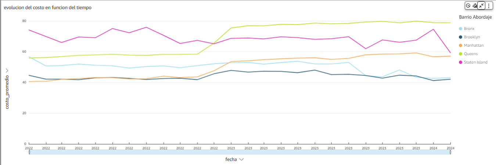
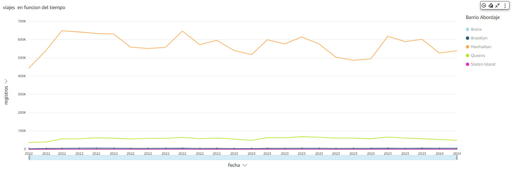
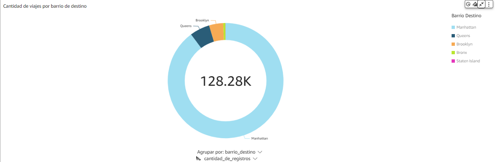
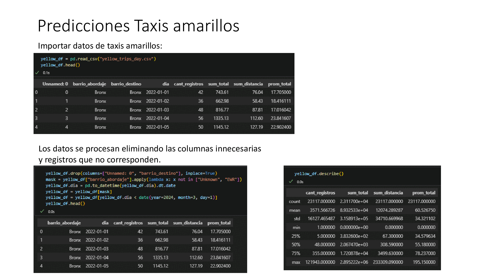
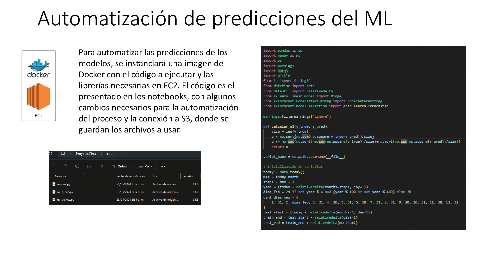

### Diseño del dashboard
---

### KPIs
---

### Análisis Exploratorio de Datos
---
Presentamos y analizamos algunos de los hallazgos de nuestro trabajo. Los resultados obtenidos se discuten en detalle en el informe con la finalidad de proporcionar una comprensión más clara y profunda de los datos recopilados.

- Evolucion del costo de los viajes en el tiempo

- Evolucion de la cantidad de viajes en el tiempo

- Cantidad de viajes de taxis verdes por barrios

### Modelo machine learning
---
### [Informe modelo Machine Learning](../Informe/Predicciones_Taxis.md)

### Modelo machine learning en producción
---

### Funcionalidad 
---

